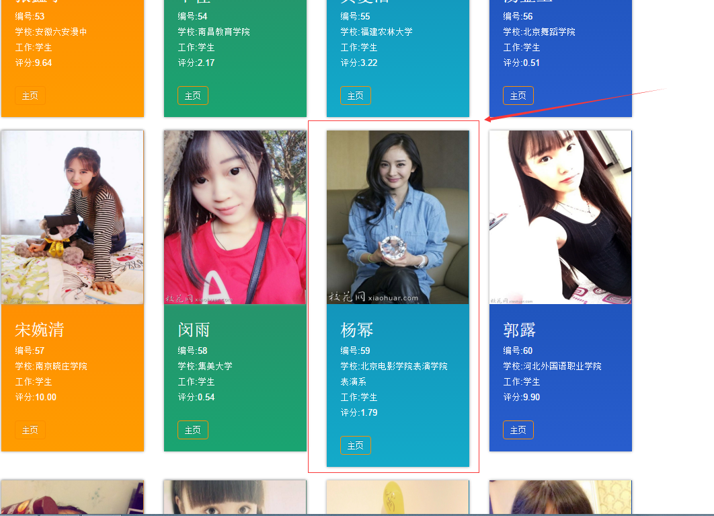
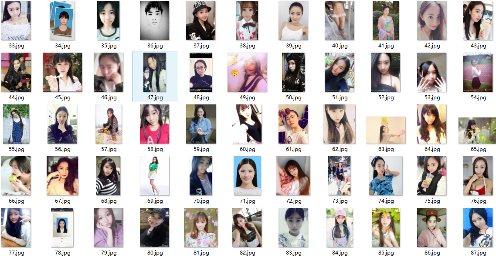
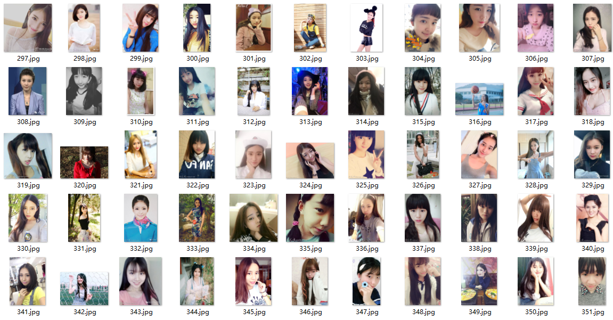

# 爬取各个学校校花的照片和资料


---

## 爬取网页简介 ##
爬取的网站是校花网，里面列举了许多“校花”的照片，还提供了很多校花的信息，现在先看看网站的布局与结构：

 1. 网站的url构成
    校花主页的链接如下：http://www.xiaohuar.com/list-1-0.html
    主要由两部分构成，第一部分是基地址 http://www.xiaohuar.com/
    第二部分是 list-1-0 其中1表示我们现在查看的是美女校花的页面，0表示我们查看是第0页（毕竟程序员都是从0开始数数），所以需要改变的也就是只有0这个位置的数，经过查看，目前该网站一共有39页。

 2. 网站布局信息，校花列表页面

其中点击校花的名字可以进入校花的个人主页：

在这里我们将要获得校花的信息包括：照片（下载），姓名，学校，职业，评分，以及主页地址。
 3. 获取信息的格式：
首先我们回到列表页面来查看每个妹子的列表页html代码构成

```html

<span class="price">胡菽尹</span>
					<div class="btns">
						<a href="http://www.xiaohuar.com/" class="img_album_btn">桥头胡中学</a>
					</div>
				</div>
				<div class="title"><span><a href="http://www.xiaohuar.com/p-1-1691.html"  target="_blank">桥头胡中学校花胡菽尹</a></span></div>
			</div>
			<div class="item_b clearfix">
				<div class="items_likes fl">
					<a href="JavaScript:makeRequest('http://www.xiaohuar.com/e/public/digg?classid=1&id=1691&dotop=1&doajax=1&ajaxarea=digg1691','EchoReturnedText','GET','');" class="like_btn"></a>
					<em class="bold" id="digg1691">70</em>
				</div>
				<div class="items_comment fr"><em class="bold"><a href="http://www.xiaohuar.com/p-1-1691.html"><span class="ds-thread-count" data-thread-key="1691" data-count-type="comments"></span></a></em></div>
			</div>
		</div><div class="item masonry_brick">
			<div class="item_t">
				<div class="img">
					<a href="http://www.xiaohuar.com/p-1-1690.html"  target="_blank"><a href="http://www.xiaohuar.com/p-1-1691.html"  target="_blank">桥头胡中学校花胡菽尹</a></span>

```

正则表达式：

```html

 <span><a href=\"http://www.xiaohuar.com/p-1-(.*?).html\"  target=\"_blank\">.*?</a></span>
 
```

**注意**：*这里有一个坑，就是可能存在404的情况，即爬取的过程中可能出现HttpError，所以先做好处理异常的准备*


现在来到妹子的主页，使用浏览器查看元素：
其中，姓名，学校，职业，得分，照片地址如下：

```html

<td class="info_td">姓 名：</td><td>江夏天</td>
<td class="info_td">学 校：</td><td>厦门大学</td>
<td class="info_td">职 业：</td><td>学生</td>
<span id="span_score" class="score">8.48</span>


```

都可以用正则表达式进行解决。

**注意**，*这里又有一个坑，如上所示，图片的url都是相对主页地址的形式，即* /d/file/20160803/7ba694114698f78162751a3d91d43436.jpg 其真正的地址应该是：
http://www.xiaohuar.com/d/file/20160803/7ba694114698f78162751a3d91d43436.jpg

但是这个网站并不按常理出牌，有些妹子的照片它又写的是完整的url。而我一开始处理url的方式如下：

```python

 self.baseUrl+re.findall(self.pattern_photo,page)[0]
 
```
即将baseUrl 和图片的相对url相加。当遇到网站给出的是完整的url的情况下，就会出现 http://www.xiaohuar.comwww.xiaohuar.com/d/file/20160803/7ba694114698f78162751a3d91d43436.jpg 这种情况，显然下载的时候就404了，所以还是一开始就用

```python

urljoin(self.baseUrl,re.findall(self.pattern_photo,page)[0]) 

```

urljoin方法吧。


----------

## 抓取功能实现 ##

上述网站分析得差不多就可以开始动手写了，信息抓取后主要是存储与写入，可以选择写入数据库，也可以写入文本文件，在这里我采用的是写入文本文件的方式，写入了html文档，以图文混排的形式进行写入的，网上找了一个html模板（主要是为了好看，有点强迫症），改了改，在网上爬了10页的数据，大约300多张照片，最后展示出来是下面的形式：

当然你会发现还有杨幂


照片都存在了本地的一个文件夹，



附上代码：

```python

#encoding:utf-8
#url = http://www.xiaohuar.com/list-1-0.html   0 表示第几页
import urllib
from urllib.request import Request
from urllib.request import urlopen
import re
from urllib.parse import urljoin
class Spider():

    def __init__(self,baseUrl):
        #网站基地址
        self.baseUrl = baseUrl
        #判断是不是最后一页
        self.lastListPage = False
        #列表页数是从０开始记录的
        self.PageIndex = 0
        #记录校花的个数，ｉｄ
        self.MMid = 1

        #存取的文件
        self.file = None

        #文件的路径地址
        self.fileName = '../mm.html'

        #记录几个获取ｍｍ信息的正则表达式patter,避免重复获取浪费时间

        #名字
        # <td class="info_td">姓 名：</td>
        # <td>胡菽尹</td>
        self.pattern_name = re.compile('<td class="info_td">姓 名：</td><td>(.*?)</td>', re.S)

        #学校
        #<td class="info_td">学 校：</td><td>桥头胡中学</td>
        self.pattern_school = re.compile('<td class="info_td">学 校：</td><td>(.*?)</td>', re.S)

        #职业
        #<td class="info_td">职 业：</td><td>学生</td>
        self.pattern_job = re.compile('<td class="info_td">职 业：</td><td>(.*?)</td>', re.S)

        #评分
        #<span id="span_score" class="score">9.78</span>
        self.pattern_score = re.compile('<span id="span_score" class="score">(.*?)</span>', re.S)

        #照片
        #
        self.pattern_photo = re.compile('', re.S)

    #获得ｍｍ列表页的html代码
    def getPage(self,pageIndex):
        try:
            # 判断最后页
            # if self.lastListPage == True:
            #     return None

            url = self.baseUrl +"/list-1-"+ str(pageIndex)+".html"
            request = Request(url)
            response = urlopen(request)
            return response.read().decode('GBK')
            #如果不加就是访问错误
            # request.add_header("User-Agent","Mozilla/5.0 (X11; Ubuntu; Linux x86_64; rv:48.0) Gecko/20100101 Firefox/48.0")
            # request.add_header("Host", "www.xiaohuar.com")
            # response = urlopen(url)
            # return response.read().decode('utf-8')

        except :
            print('连接错误')
            return None

    #获得ｍｍ的主页的htmlcode
    def getMMMinePage(self,url):
        try:
            request = Request(url)
            response = urlopen(request)
            return response.read().decode('GBK')
            # 页面不存在抛出异常

        except HttpError as e:
            if hasattr(e, 'reason'):
                print('连接错误，错误原因', e.reason)
            return None

    #获得一页的ＭＭ的信息
    def getContent(self,pageIndex):
        MMs = []
        page = self.getPage(pageIndex)
        # print(page)
        #测试该页是不是最后一页
        # self.ifTheLastPage(page)
        #如果是最后一页
        if page is None:
            return None
        #每个校花的列表页面,获得主页
		#<span><a href="http://www.xiaohuar.com/p-1-1691.html"  target="_blank">桥头胡中学校花胡菽尹</a></span>
        #<span><a href=\"http://www.xiaohuar.com/p-1-(.*?).html\"  target=\"_blank\">.*?</a></span>
        pattern = re.compile("<span><a href=\"http://www.xiaohuar.com/p-1-(.*?).html\"  target=\"_blank\">.*?</a></span>", re.S)
        items = re.findall(pattern, page)

        for item in items:
            # print(item)
            url = "http://www.xiaohuar.com/p-1-"+str(item)+".html"
            MM = self.getMMContent(url,self.MMid)
            #下载照片
            # print(MM['photo'])
            self.downloadPhoto(MM['photo'],self.MMid)
            MMs.append(MM)
            self.MMid+=1
        #返回该页的校花的信息的列表
        return MMs

    #获得每个校花的信息
    def getMMContent(self,mmPageUrl,MMid):
        MM = {}
        page = self.getMMMinePage(mmPageUrl)
        #获取名字
        name = re.findall(self.pattern_name,page)[0]
        school = re.findall(self.pattern_school,page)[0]
        job = re.findall(self.pattern_job,page)[0]
        score = re.findall(self.pattern_score, page)[0]
 #!!       #前面给出的照片的ｕｒｌ是相对的地址，真正的url需要加上网站基地址
        # 而不是简单　１４页　第三个
        photo =urljoin(self.baseUrl,re.findall(self.pattern_photo,page)[0])  #        self.baseUrl+re.findall(self.pattern_photo,page)[0]
        # print("zhaopian",photo)
        MM['id'] = MMid
        MM['name'] = name
        MM['school'] = school
        MM['job'] = job
        MM['score'] = score
        MM['photo'] = photo
        MM['url'] = mmPageUrl

        return MM
    #获得当前页是不是最后一页
    # def ifTheLastPage(self,pageCode):
    #     #<a href="http://www.xiaohuar.com/list-1-38.html">39</a><b>40</b>
    #     #<a href.*?>\d*?</a>
    #     pattern = re.compile("<a href=\"http://www.xiaohuar.com/list-1-\d{1,3}.html\">\d{1,3}</a>&nbsp;<b>40</b>",re.S)
    #     #这里测试是否找到：
    #     ma = re.findall(pattern,pageCode)
    #     print(ma)
    #     #如果没有匹配成功
    #     if ma:
    #         self.lastListPage = True


    # 创建并且打开文件
    def openFile(self, title):
        # 如果标题不是为None，即成功获取到标题
        if title is not None:
            self.file = open(title, "w+")
        else:
            print("创建html文件失败")
            return None

    # 写入文件,一次写入一页
    #<div class="bot-grid0"> 这里用ｉｄ决定
	# 
	# <h3>Name</h3>
	# <p>
	# <span>id</span><br>
	# <span>school</span><br>
	# <span>job</span><br>
	# <span>score</span>
	# </p>
	# <a href="#">
	# <p>
	# <span class="one">主页</span>
	# </p>
	# </a>
	# </div>

    def writeFile(self, contents):
        for item in contents:
            #文字部分ｄｉｖ的颜色，分别有４种
            style = (int(item['id'])-1)%4
            mm = "<div class=\"bot-grid"+str(style)+"\">\n"
            #src="./photo/id.jpg"
            mm = mm+"\n"
            mm = mm+"<h3>"+item['name']+"</h3>\n<p>"
            mm = mm+"<span>编号:"+str(item['id'])+"</span><br>\n"+"<span>学校:"+item['school']+"</span><br>\n"
            mm = mm+"<span>工作:"+item['job']+"</span><br>\n"+"<span>评分:"+item['score']+"</span><br>\n</p>"
            mm = mm+"<a href=\""+item['url']+"\">\n<p>\n<span class=\"one\">主页</span>\n</p>\n</a>\n</div>\n"
            try:
                self.file.write(mm)
            except:
                print("mm")

    #　下载妹妹照片
    def downloadPhoto(self,url,id):
        #在上层目录下创建一个photo文件夹来存下载的照片
        f = open("../photo/"+str(id)+'.jpg','wb')
        defaultUrl = "http://pythonscraping.com/img/lrg%20(1).jpg"
        try:
            req = urlopen(url)
            print(url, id)

        except:
            req = urlopen(defaultUrl)
            print("下载异常", url, id)
        finally:
            buf = req.read()
            f.write(buf)
            f.close()

    def start(self):
        # 打开文件
        self.openFile(self.fileName)
        try:
            html_head="""
            <!DOCTYPE HTML>
            <html>
            <head>
                <link href="./style.css" rel="stylesheet" type="text/css" media="all" />
                <meta http-equiv="Content-Type" content="text/html; charset=utf-8" />
                <style type="text/css" id="znBdcsStyle">
                </style>
                </head>
                <body>
                <div class="clearfix"></div>
                <div class="wrap">
                    <div class="wrapper">
                        <div class="content">
                            <div class="grids">
            """

            html_foot="""
            <div class="clear"></div>
					</div>
				</div>
			</div>
            </body>
			</html>
            """
            #写入ｈｔｍｌ文件的上部
            self.file.write(html_head)
            #循环写入所有页
            forid = 0
            while True:
                indexPage = self.getContent(forid)
                if forid == 39:
                    break
                self.writeFile(indexPage)
                forid+=1

            self.file.write(html_foot)
        # 出现写入异常
        except:
            print("写入异常")
            print(forid)

        finally:
            print
            print("校花信息已经收集完毕")
            self.file.close()
url = "http://www.xiaohuar.com"
MM = Spider(url)
MM.start()

```